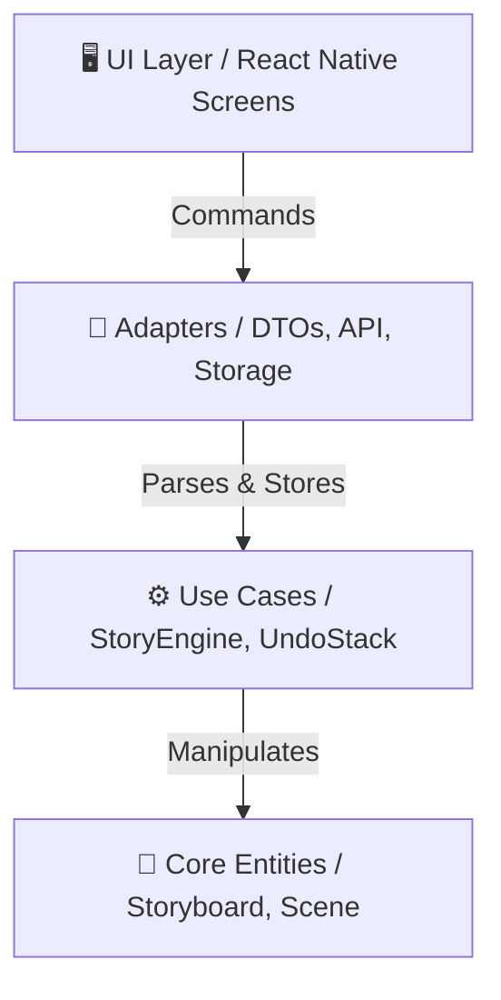

<div align="center">
  
  <h1>AI Storyboard 🎬</h1>
  <h3>Redefining storytelling through technology and AI</h3>

  <p>
    Built towards the <b>Vietnam Visual eXperience (VVX)</b> standards, accelerating the future of next-generation media using AI-driven creation tools.
  </p>
  
  <br />

  <!-- Chèn Link Tải App Bằng EAS URL Của Sếp Vào Đây -->
  [-4630EB?style=for-the-badge&logo=android)](#-download--test)
  [](#-iosapple-fast-track-pwa-web-app)
  [](https://expo.dev/)
  [](https://www.typescriptlang.org/)
</div>


---

## 🎯 About The Project

**AI Storyboard** is an autonomous creation tool designed to empower storytellers. By combining production technology with artificial intelligence (Gemini), the application translates raw text prompts into structured, highly visual storyboard scenes instantly.

This project was built from the ground up focusing heavily on **Software Architecture**, **High-Performance Data Structures (DSA)**, and **Resilience Edge-Cases** to meet the rigorous engineering standards expected of a Mobile Engineer.

### ✨ Visual eXperience & Features
* **AI-Driven Generation:** Transforms simple ideas into an interconnected network of scenes.
* **Haptic & Dynamic Reordering:** Fluid Drag-and-Drop capability providing a seamless UI/UX.
* **Time-Travel Mechanics:** Highly efficient O(1) Undo/Redo stack for instantaneous state recovery.
* **Offline Resilience:** Auto-switching to robust local cache mechanisms via AsyncStorage.

*(Insert Demo GIF here - e.g. ``)*

---

## 🧠 Core Engineering Highlights (DSA & Architecture)

To ensure smooth "Real-Time Engine" performance on mobile, the core business rule relies on traditional Data Structures, intentionally avoiding expensive array map/filter loops on large data sets.

### 1. The Doubly Linked List Engine
Behind the visually rich UI, the scenes are mapped via a `prevNode` and `nextNode` linked-list structure (`StoryEngine.ts`).
- **Why?** Reordering operations (Drag & Drop) are reduced to pointer swaps `O(1)` instead of unshifting whole arrays `O(N)`. This prevents JS Thread frame-drops during aggressive reordering animations.

### 2. Bounded Stack for Time Travel
The Undo/Redo system is implemented via a bounded memory Stack (`UndoRedoStack.ts`).
- **Memory Safety:** To prevent Memory Leaks causing App crases, the stack limits historical pointers exactly to depth N. Pushing beyond N drops the tail in `O(1)` amortized time.

### 3. AI ReDoS & Truncation Shield (Bulletproof JSON)
Relying on external Prompt streams creates dangerous edge cases. The `safeParseAiResponse.ts` layer specifically combats:
- **Truncated JSON Recovery:** Auto-filling broken trailing bracket errors.
- **ReDoS Attacks:** Blocking maliciously massive prompt outputs that lock the JS Thread, guaranteeing 60FPS UI persistence regardless of API status.

---

## 🏗 System Architecture (Clean Architecture)

Implementing strict separation of concerns to allow limitless horizontal scaling (e.g., swapping Gemini for Claude, or Expo Local Storage for SQLite).


* **Entities:** Pure TS interfaces (`/src/core`).
* **Use Cases:** Deep DSA logic without React bindings (`/src/use_cases`).
* **Adapters:** Side-effects handling like APIs and LocalStorage (`/src/adapters`).
* **UI:** Pure presentation layers stripped of heavy logic (`/src/ui`).

---

## 🚀 Getting Started

To clone and run this application locally, you will need **Node.js (>= 18)** and **npm**.

### 1. Installation
```bash
# Clone the repository
git clone https://github.com/BaoVuong150/AI-Storyboard.git

# Go into the repository
cd AI-Storyboard

# Install dependencies (Strict install)
npm install
```

### 2. Environment Setup (Critical)
The project utilizes the Gemini API for generative AI capabilities.
```bash
# 1. Copy the example env file
cp .env.example .env

# 2. Open .env and add your free Gemini API key:
EXPO_PUBLIC_GEMINI_API_KEY=your_api_key_here
```

### 3. Run on Emulator / Local
```bash
npm start
# Follow Expo CLI instructions (Press 'a' for Android, 'i' for iOS)
```

### 🧪 Unit Testing
```bash
# Verify AI parsing logic and DSA integrity
npm test
```

---

## 📥 Download & Test
*(For Recruiters & Guests)* 

You can test the latest production-grade `.apk` directly on an Android device:
1. Turn on Android Phone camera.
2. Scan the Expo EAS QR Code below or follow the link.
3. Install and try the "Visual eXperience"!

**👉 [🔗 EAS Build Link - Download APK Here](https://expo.dev/accounts/baovuong123/projects/ai-storyboard/builds/fe3777d7-5ec2-4948-8f98-34a46a67e419)**

### 🍏 iOS/Apple Fast Track (PWA Web App)
Due to Apple's strict distribution policies, providing direct `.ipa` files is impossible. However, to guarantee an identical "Native-like" Visual eXperience for reviewers using **iPhones**, a PWA Web version is deployed via Vercel.

**👉 [🔗 Open Web Application Demo](https://ai-storyboard-two.vercel.app/)**

**To install on iPhone:**
1. Open the Vercel link using **Safari**.
2. Tap the `Share` icon (square with an up arrow) at the bottom.
3. Select **"Add to Home Screen"**.
4. Launch the application from your home screen to experience it in a standalone, edge-to-edge UI (Hiding the browser URL bar like a real Native App!).

---
<div align="center">
  <p>Built with 🩵 by Bao Vuong</p>
</div>
